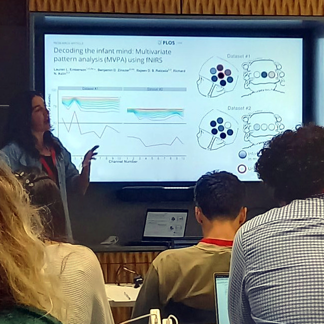
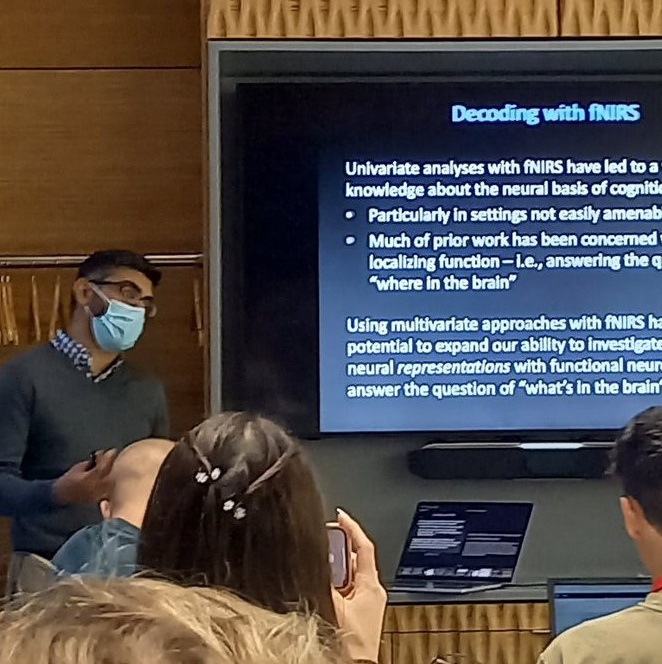
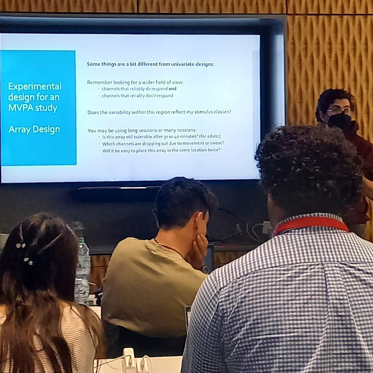

[\[Home\]](index.html) \| [\[Team\]](team.html) \| [\[Education\]](educ.html)

### Events
You can find [downloadable educational materials](#educational-materials) from the following presentations below.  
- **14 December 2022** We presented a free webinar organized by the SfNIRS educational committee. ([Recording](https://fnirs.org/events/educational-tutorials/) hosted by [SfNIRS](https://fnirs.org).)  
- **9 October 2022** We presented a three hour educational mini-course at the SfNIRS biannual meeting in Boston, MA, USA. 

## Educational Materials 
### Multivariate pattern analysis for fNIRS
- Download the slides from the 2022 webinar [here](https://github.com/TeamMCPA/TeamMCPA.github.io/raw/master/Slides_MVPA_and_fNIRS_forWeb.pdf) (PDF, 4.5 MB)
- Download the Homer data files and analysis scripts for our hands-on tutorial [here](https://drive.google.com/drive/folders/1GutVh7Av33zaY3FzjUB2A491XnM5MXF8?usp=sharing) (Google Drive directory).
- Download the repository branch for this tutorial session [here](https://github.com/TeamMCPA/Consortium-Analyses/archive/refs/heads/SfNIRS_2022.zip) (Github .zip download; required for the script files above).

 
